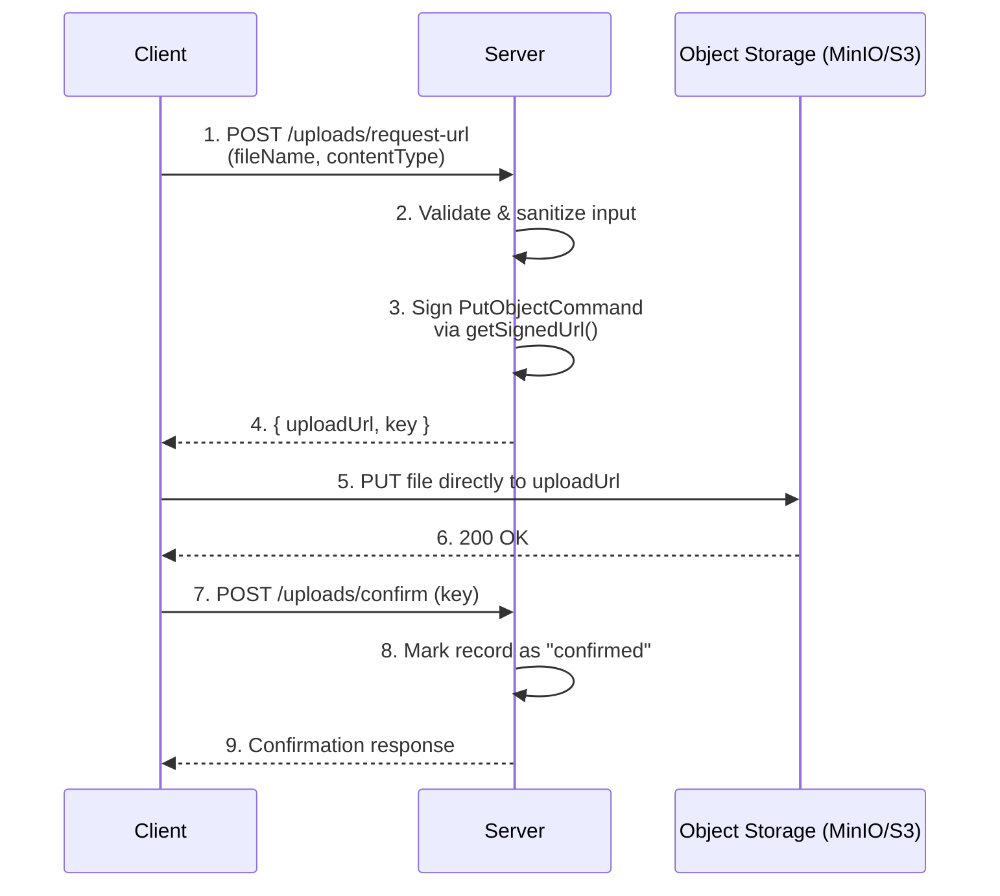

# Presigned URL Demo

A learning project to understand the **presigned URL pattern** — a technique for uploading/downloading files directly to object storage without passing through the application server.

## Why Presigned URL?

Conventional upload flow usually looks like this:

```
Client --file--> Server --file--> Object Storage
```

The server becomes a bottleneck: it has to buffer large files in memory/disk, bandwidth is doubled (receiving from client, then re-sending to storage), and it's prone to overload under concurrent uploads.

With the presigned URL pattern:

```
Client --request permission--> Server --generates URL--> Client
Client --file (direct)--> Object Storage
```

The server only signs a temporary upload permission. The file itself never passes through the server.

## Architecture

### Flow Diagram



The server is only involved in **steps 1–4** (issuing permission) and **steps 7–9** (recording confirmation). The actual file transfer in **step 5** happens directly between the client and the object storage — the server's resources (memory, bandwidth, CPU) are never touched by the file itself, regardless of its size.

### Components

| Component | Role |
|---|---|
| `src/s3Client.js` | Configures the S3-compatible client (`S3Client`) pointed at MinIO, plus the target bucket name |
| `src/server.js` | Native HTTP server exposing endpoints to generate presigned URLs, confirm uploads, and generate download URLs |
| `docker-compose.yml` | Defines and runs the local MinIO container (object storage) |
| `uploadRecords` (in-memory array) | Tracks upload state (`pending` → `confirmed`) — stands in for what a real database table would do |

### Two Signing Strategies

This project demonstrates two different presigned URL mechanisms, each suited to a different level of control:

1. **Query-string signing** (`getSignedUrl` + `PutObjectCommand`) — the signature and all metadata are embedded in a single URL. Simple, works with a plain `PUT` request. Used for `/uploads/request-url` and the download endpoint.
2. **POST policy signing** (`createPresignedPost`) — the signature is bound to a set of *conditions* (e.g. `content-length-range`, exact `Content-Type` match), returned as separate form fields that must be submitted via multipart form-data. Used for `/uploads/request-url-with-limit`, where file size needs to be enforced before the upload is accepted — not just validated after the fact in application code.

### Security Notes

- Every presigned URL has a short expiry (5 minutes) — after that, the URL becomes invalid even if the format looks unchanged.
- The signature is a cryptographic hash of the bucket, key, content-type, expiry, and secret key. Modifying any part of the URL (e.g. swapping the file path) invalidates the signature, so the request gets rejected by the storage server itself.
- Content-type is whitelisted and filenames are sanitized server-side, *before* a URL is signed — this prevents arbitrary file types or path traversal attempts from ever getting a valid signed URL in the first place.
- File size limits (via `createPresignedPost`) are enforced by the storage server based on the signed policy, not by the application server — so even if a client bypasses the app entirely and hits the storage endpoint directly, the constraint still holds.

## Tech Stack

- **Node.js** (native `http` module, no framework)
- **MinIO** — S3-compatible object storage, run via Docker (used to simulate S3 locally, free of cost)
- **AWS SDK v3** (`@aws-sdk/client-s3`, `@aws-sdk/s3-request-presigner`, `@aws-sdk/s3-presigned-post`)

## Setup

1. Start MinIO:
```bash
   docker compose up -d
```
2. Open `http://localhost:9001` (login `minioadmin` / `minioadmin`), create a bucket named `presigned-url-demo`.
3. Install dependencies:
```bash
   npm install
```
4. Start the server:
```bash
   node src/server.js
```
   Server runs on `http://localhost:3000`.

## Endpoints

| Method | Path | Description |
|---|---|---|
| POST | `/uploads/request-url` | Generate a presigned URL for upload (PUT-based, simple) |
| POST | `/uploads/request-url-with-limit` | Generate a presigned POST with a file size limit (5MB) |
| POST | `/uploads/confirm` | Confirm that an upload has completed |
| GET | `/uploads` | List all upload records (for debugging) |
| GET | `/uploads/download-url?key=...` | Generate a presigned URL for download (GET-based) |

## Concepts Covered

- **PUT-based presigned URL** — suitable for minimal control (bucket, key, content-type)
- **POST-based presigned URL** (`createPresignedPost`) — for more complex constraints like `content-length-range` (file size limit), enforced at the signature level rather than just in application code
- **Input validation & sanitization** — content-type whitelisting, filename sanitization to prevent path traversal
- **Upload confirmation flow** — the server never knows an upload succeeded without an explicit confirmation step from the client (or a storage event notification in a real-world setup)
- **Presigned download URL** — grants temporary read access to a file in a private bucket

## Notes

- `uploadRecords` in this server is stored **in-memory** (a plain array), for learning purposes only. In a real-world project, this would be replaced by a persistent database (Postgres/Prisma).
- This project is kept separate from the main portfolio project (`rail-booking-engine`) so that learning the presigned URL pattern stays focused without mixing in unrelated complexity.